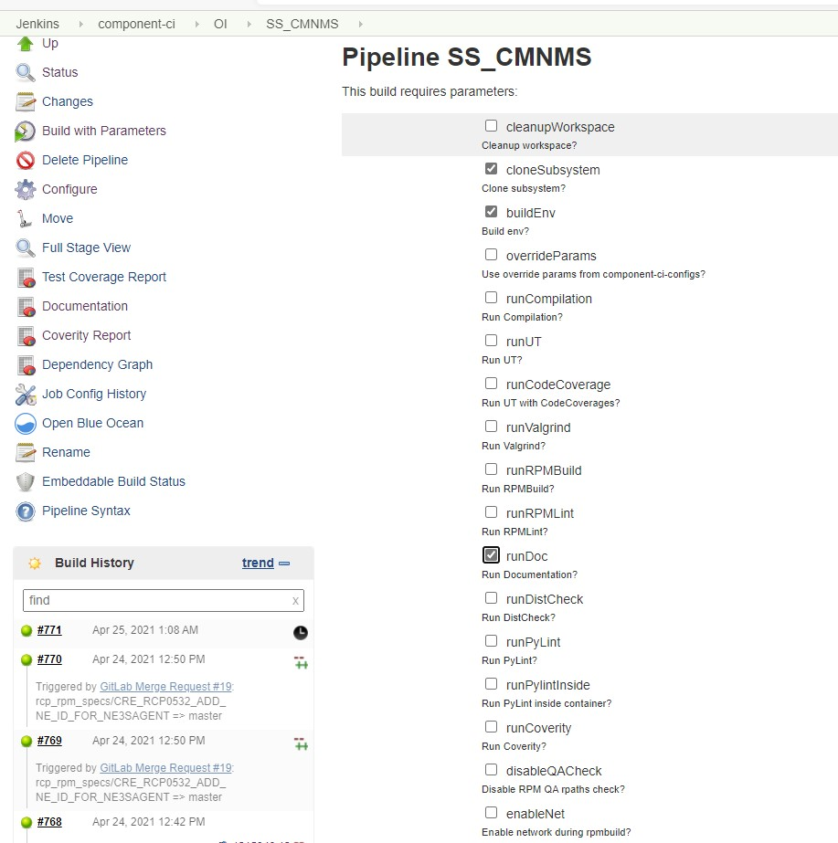
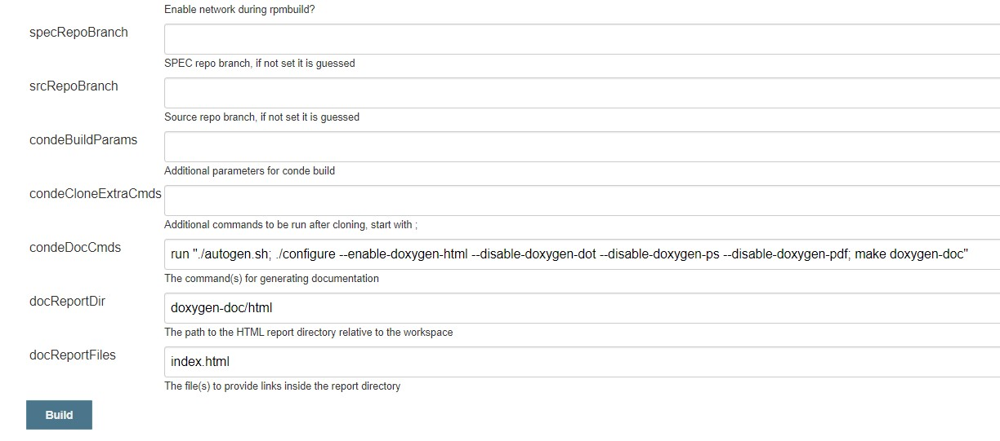
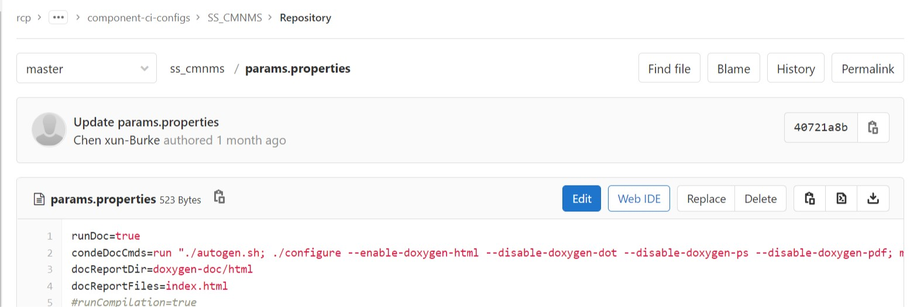

**********************
Doxygen Guidelines
**********************

.. contents:: :local:

1. Doxygen introduction
############################

Doxygen is the de facto standard tool for generating documentation from annotated C++ sources,
but it also supports other popular programming languages such as C, Objective-C, C#, PHP, Java,
Python, IDL (Corba, Microsoft, and UNO/OpenOffice flavors), Fortran, VHDL, and to some extent D.
Go to start `doxygen <https://www.doxygen.nl/index.html>`_

2. How to use doxygen in RCP subsystems
###########################################

2.1. Support doxygen in SPEC file
*********************************

Add doxygen package in your subsystem SPEC file, the doxygen binary can be
installed from that. Here is the syntax:
::

 BuildRequires:  doxygen

2.2. Create doxygen configuration file
**************************************

In this file, you can custom some interesting features for your documentation.
If the doxygen binary is installed, use this command to generate the configuration file:
::

 doxygen -g

The default configuration file name is Doxyfile.

2.3. Support doxygen in Compiler system
***************************************

Add doxygen support in the Compiler system. In RCP, most of the subsystems use autotools
as their Compiler system. Here is an example of Doxygen for autotools. For others, you can
refer to the `official link <https://www.doxygen.nl/index.html>`_ .
For autotools, we can set some default values for the features.

DX_INIT_DOXYGEN(PROJECT-NAME, [DOXYFILE-PATH], [OUTPUT-DIR])
::

 PROJECT-NAME is the doxygen documentation title name.
 DOXYFILE-PATH is the configuration file name (the default is '$(srcdir)/Doxyfile'
 OUTPUT-DIR is the output directory name (the default is ’doxygen-doc’)

DX_DOXYGEN_FEATURE(ON|OFF)
::

 Support doxygen itself

DX_DOT_FEATURE(ON|OFF)
::

 For generating graphics

DX_HTML_FEATURE(ON|OFF)
::

 For plain HTML

DX_CHM_FEATURE(ON|OFF)
::

 For compressed HTML help(for MS users)

DX_CHI_FEATURE(ON|OFF)
::

 For generating a separate .chi file by the .chm file

DX_MAN_FEATURE(ON|OFF)
::

 For generating Man page

DX_RTF_FEATURE(ON|OFF)
::

 For generating RTF(for MS users)

DX_XML_FEATURE(ON|OFF)
::

 For generating xml

DX_PDF_FEATURE(ON|OFF)
::

 For generating pdf

DX_PS_FEATURE(ON|OFF)
::

 For generating postScript documentation

Macros Notes:
::

 The macros mainly control the default state of the feature. The user can override the
 default by specifying -–enable or -–disable. The macros ensure that contradictory flags
 are not given (e.g., -–enable-doxygen-html and -–enable-doxygen-chm, -–enable-doxygen-anything
 with -–disable-doxygen, etc.) Finally, each feature will be automatically disabled (with a warning)
 if the required programs are missing.

 Unfortunately, currently WadersOS doesn't have the necessary tools required for pdf, ps, etc. output
 formats. Also dot (i.e. graphviz) is missing.
 We'd better not to use those features.

Automake support

The DX_RULES substitution can be used to add all needed rules to the Makefile. Note that this is a
substitution without being a variable: only the @DX_RULES@ syntax will work.
::

 @DX_RULES@
 MOSTLYCLEANFILES += $(DX_CLEANFILES)

2.4. Generate the doxygen documentation
***************************************

If you have enables some doxygen feature in configure.ac, you can use this command to generate the
documentation:
::

 ./configure
 make doxygen-doc

If you don't want to generate extra documentation like pdf or ps, then you can use this way:
::

 ./configure --disable-doxygen-pdf --disable-doxygen-ps
 make doxygen-doc

2.5. Build the doxygen documentation by doxygen tool
****************************************************

It is also a good to generate the doxygen documentation by doxygen tool. It can help you quickly
debug the documentation's effect. Use this command to implement that:
::

 doxygen configuration_file_name

2.6. Build the doxygen documentation in component-Ci
****************************************************

If subsystem wants to provide a official documentation link, then implementing documentation in component-ci
can be a good way. There are two ways for to generate documentation in component-ci, take SS_CMNMS as an example:

2.6.1. Generate documentation manually
++++++++++++++++++++++++++++++++++++++

Enter the `Build with Parameters <http://component-ci-jenkins.eecloud.dynamic.nsn-net.net:8080/job/component-ci/view/OI/job/SS_CMNMS/build?delay=0sec>`_ page of SS_CMNMS's pipeline.
Then you can see the some check-boxes of building requires parameters:

The check-boxes you need to select are **cloneSubsystem**, **buildEnv**, **runDoc**, other are not mandatory.
Then scroll down the web page, you can see some Edit boxes:

condeBuildParams & condeCloneExtraCmds:
::

 condeBuildParams and condeCloneExtraCmds are useless for this featrue.

specRepoBranch & srcRepoBranch:
::

 For specRepoBranch and srcRepoBranch, if there is no any input, then component-ci will use the default branch
 of SPEC or Source code.

condeDocCmds:
::

 The command(s) for generating documentation.

docReportDir:
::

 The path to the HTML report directory relative to the workspace.

docReportFiles:
::

 The file(s) to provide links inside the report directory

You can configure the corresponding parameters according to the above prompts.
After finished that, click the **Build** button to generate your documentation.
You can click `Documentation <http://component-ci-jenkins.eecloud.dynamic.nsn-net.net:8080/job/component-ci/view/OI/job/SS_CMNMS/Documentation/>`_ to access your documentation.

2.6.2. Generate documentation automatically
+++++++++++++++++++++++++++++++++++++++++++

If you prefer to generate the documentation automatically.
You can set the default behavior for your subsystem's pipeline.
That can be implemented in `component-ci-configs <https://gitlabe2.ext.net.nokia.com/rcp/tools/component-ci-configs/ss_cmnms/-/blob/master/params.properties>`_.
At least you should add 4 parameters in this config file:

If the default behavior is set, then once the component-ci is triggered, the job of creating documentation is on the way.

3. Suggested learning material
##############################

Following trainings and instructions are useful:

1. Doxygen in Github https://github.com/doxygen/doxygen
2. How to install Doxygen https://www.doxygen.nl/manual/install.html
3. Support doxygen in autotools https://www.gnu.org/software/autoconf-archive/ax_prog_doxygen.html
4. Example documentation generated by Doxygen in RCP http://component-ci-jenkins.eecloud.dynamic.nsn-net.net:8080/job/component-ci/view/OI/job/SS_CMNMS/Documentation/

