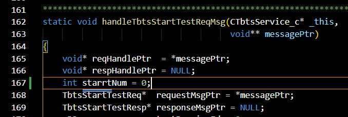
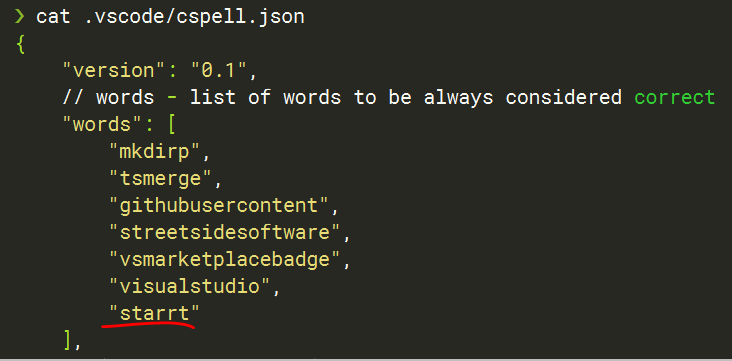

.. _Spell Checking With VSCode Guidelines:

*************************************
Spell Checking With VSCode Guidelines
*************************************

Introduction
#############

`Visual Studio Code <https://code.visualstudio.com/>`_ tool supports automatic spell-checking.

Code Spell Checker extension supports camelCase spell-checking.
See the `instructions <https://marketplace.visualstudio.com/items?itemName=streetsidesoftware.code-spell-checker>`_.

List some tips as below
#######################

1. Words not in the dictionary files will have double dash underline
--------------------------------------------------------------------

For example: spelling error **starrt** as below picture:

2. Customization about configuration in **Visual Studio Code**
--------------------------------------------------------------

The spell checker configuration can be controlled via VS Code preferences or cspell.json configuration file.
Order of precedence
Firstly -> Workspace Folder cspell.json
Secondly -> Workspace Folder .vscode/cspell.json
Thirdly -> VS Code Preferences cSpell section

3. Adding yourself words(which is not unrecognized by default dictionary) to the Workspace Dictionary
-----------------------------------------------------------------------------------------------------

For example: Add **starrt** as correct word in **.vscode/cspell.json** as below:

